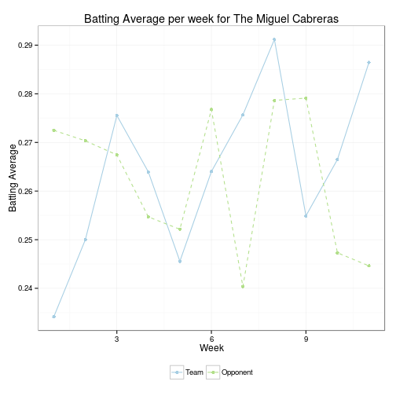
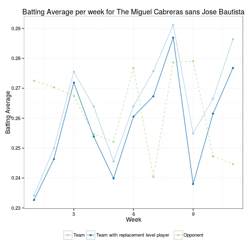

## The Vision


- Advanced Statistics have revolutionized how baseball is played and managed.
    - Wins above replacement, wRC+, xFIP, . . .
- Advanced Statistics will revolutionize your fantasy baseball league too.
- Don't get left in the dust!
- See how it works . . .

---

## How it works


Visualize how your team has performed in each category for the season so far:

 

---

## How it works

Figure out how pivotal a player has been for you in each statistical category:

 

---

## How it works

Calculate how many wins a player has been worth this season:


```r
records <- rbind(calculate_record(weekly_totals[weekly_totals$team == team,], opponents_totals[opponents_totals$team == team,]), calculate_record(replaced_totals, opponents_totals[opponents_totals$team == team, ])); rownames(records) <- c('Actual record', 'Record without Jose Bautista')
fvalue <- records[1,1] - records[2,1] + .5 * (records[1,3] - records[2,3])
print(xtable(records), type = 'html')
```

<!-- html table generated in R 3.0.2 by xtable 1.7-3 package -->
<!-- Mon Jun 23 15:45:49 2014 -->
<TABLE border=1>
<TR> <TH>  </TH> <TH> wins </TH> <TH> losses </TH> <TH> ties </TH> <TH> win_percentage </TH>  </TR>
  <TR> <TD align="right"> Actual record </TD> <TD align="right">  40 </TD> <TD align="right">  38 </TD> <TD align="right">  10 </TD> <TD align="right"> 0.51 </TD> </TR>
  <TR> <TD align="right"> Record without Jose Bautista </TD> <TD align="right">  35 </TD> <TD align="right">  42 </TD> <TD align="right">  11 </TD> <TD align="right"> 0.46 </TD> </TR>
   </TABLE>

- Find out that Jose Bautista has been pivotal in 4.5 wins thus far this season.
- There is so much more!
- Visit [https://jhsdatascience.shinyapps.io/fantasy-baseball-player-values/](https://jhsdatascience.shinyapps.io/fantasy-baseball-player-values/) to keep exploring.
